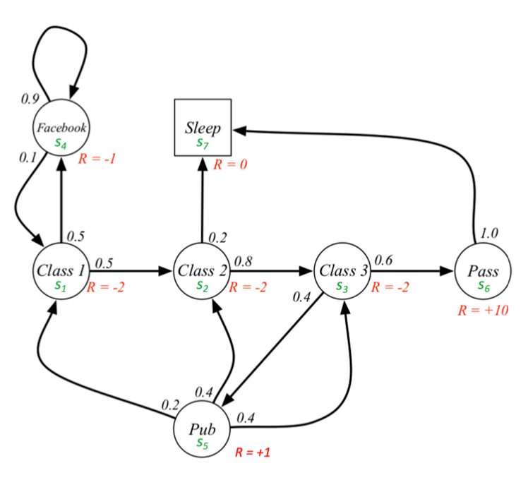
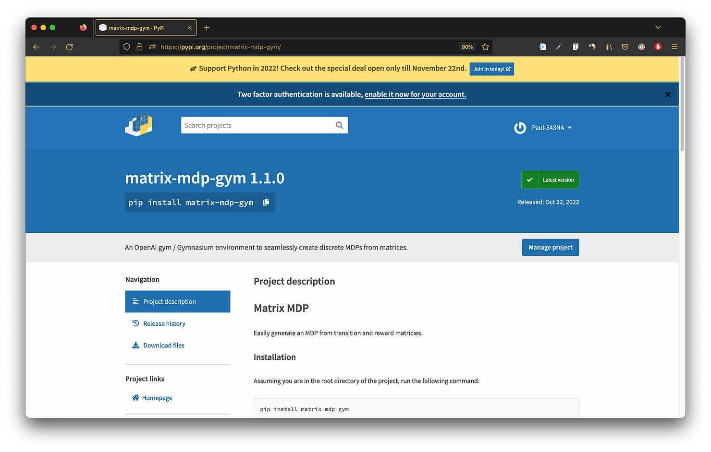

# I created a Python library to ease the life of RL practitioners !


[](https://pepy.tech/project/matrix-mdp-gym)

<strong>🎉 Celebrating 10,000 downloads on pip, thank you!</strong><br>

## The origin

A few weeks ago, I coded and made my first python library called `matrix-mdp-gym` public, here is its story.

I am currently in a more exploratory phase of my PhD where I’m looking for ideas to push my field (reinforcement learning) further.

During my reading, it happened to me quite a few times to find an interesting paper about some approach to RL, which I would be keen to Implement and run on my environments of interest.

Doing so would be great but means what looks like a lot of effort to just test an idea, so most of the time it doesn’t happen.

This is where I identified an issue: our environment does not follow the usual RL API for environments. But why is that?

This was never really a concern: when there are only 1 or 2 people working on something it does not need to be standardised, does it?

Well, that’s what I used to think, until I realised the 2 major costs this implied for our work:

* We lost time because everyone reimplements the environment when they work with it;

* We do not fit the standard RL environments API like gym environments so algorithms from outside the lab are hard to test on our example.

Realising the amount of energy and potential intellectual fruits lost, I set out on a journey to fit this RL environment we use to a standard format.

## Maybe bigger than just for our lab

Our lab has strong interests in applications of AI in healthcare and this environment I’ve been talking about models the evolution of patients with severe blood infection in the intensive care unit. I will not go into the details of how this was built here, see [the original paper](https://www.nature.com/articles/s41591-018-0213-5) for more details.

In a nutshell, this environment describes the interaction of patients going from one clinical state to the other in response to the drug doses they get.

The highlight here is that this environment has discrete states and actions. It is therefore fully characterised by three arrays:

* A vector of initial state probabilities P0(S);

* A transition probability matrix P(S’ | S, A);

* A reward matrix R(S’, S, A).

At this point, you could say that this is pretty common for discrete MDPs, and I would 100% agree with you!

As a matter of fact, such environments are used to build intuition for students in the top Reinforcement Learning modules.


Example MDP from David Silver's course at UCL.

In fact, this discrete environment being so standard and “basic” to implement is probably one of the main reasons why kept implementing it again and again without realising the cost that came with it.

At this point I think: ”Actually, because such environments are so common in RL, having a way to set one up in just a few lines of code would be beneficial to much more than my team!”

One more motivation for the project!


## Finding a standard: gym

So now I have enough motivation that this project will add value, it is time to decide on how the standard API will look like.

Fortunately, this choice was rather obvious.

Having worked with in RL for a bit, it is impossible not to be aware of this library called [gym](https://gymnasium.farama.org/): originally built by OpemAI, now maintained and improved by the [Farama Foundation](https://farama.org/Announcing-The-Farama-Foundation).

Gym has become highly popular in the RL community to the point where most papers use gym environments and the new blow Farma is giving to the project promises nothing but a bright future for this standard.

If there exists a gym environment that represents any discrete MDP from its matrices, we just have to give it our data and BOOM here’s my solution!

Excited by how close I think I am to the solution of our issues, I embark on a sail on the internet to find a gym environment that does just this: turn three matrices into a world for agents to interact with.

But I can’t fold any …

In the office, I am very fortunate to sit next to a friend who just so happens to maintain gym, how convenient is that! If such a thing exists, he should be aware of it!

I ask my friend and, after a bit of research together, we face the truth: there is none.

Convinced that this would be useful and supported by my friend, I decide to create such an environment myself.

## The realisation

After a few evenings of design, implementation, documentation and online tutorials on how to realise a package on PiPy, my library is out!



Special thanks here to Will Dudley who helped raising the final product to more professional standards.

You can now run `pip install matrix-mdp-gym` and empower yourself to create a fully functional gym environment from reward and probability matrices!

import numpy as np
import gymnasium as gym
import matrix_mdp

```python
# Load probabilities and reward matrices
r = np.load("data/AICL1_MDP_R_Sprime_S_A.npy")
p_0 = np.load("data/AICL1_MDP_P_0.npy")
p = np.load("data/AICL1_MDP_P_Sprime_S_A.npy")

# Create environment
env = gym.make('matrix_mdp/MatrixMDP-v0', p_0=p_0, p=p, r=r)
```

The package is [available on Pipy](https://pypi.org/project/matrix-mdp-gym/) and the [code is public on Github](https://github.com/Paul-543NA/matrix-mdp-gym).

No need to implement discrete MDPs by hand anyone: everything is taken care of for you and your environment is ready to go in just 3 lines of code!

This small journey opened my eyes on the benefits of standards in our field of work: having an environment with an API, and RL agents that conform to this API, means separating agent design code from environment code, reminding me a lot of code structures like MVC or MVVM from app development.

Yes, building an environment that fits these standards and properly documenting it means a bit more work than creating something just for self use, but the doors this little push opens are immense and completely worth it!

If you want to learn more about `matrix-mdp-gym`, go check the README on girhub.

If you like this environment and use it in your work, feel free to leave the project a star :)

I have so many ideas of algorithms to try on this newly standardised environment, I’ll have to get going. See you soon for more adventures!
